## 一、概述
`Apache Ambari` **是 Hortonworks 贡献给Apache开源社区的顶级项目，它是一个基于web的工具，用于安装、配置、管理和监视 Hadoop 集群。** Ambari 目前已支持大多数 Hadoop 组件，包括 HDFS、MapReduce、Hive、Pig、 Hbase、Zookeper、Sqoop 和 Hcatalog 等。


想了解更多 Apache Ambari 可以阅读我这篇文章：[【大数据】大数据 Hadoop 管理工具 Apache Ambari（HDP）](https://mp.weixin.qq.com/s?__biz=MzI3MDM5NjgwNg==&mid=2247488159&idx=1&sn=c3528f233851ba5fb0afc297786e63c1&chksm=ead0ee76dda767609fa54dbdc576b3ddefcb32a910f20c0e0f8f93b8a122ab1c073db375b307#rd)

## 二、前期准备
### 1）部署 docker
```bash
# 安装yum-config-manager配置工具
yum -y install yum-utils

# 建议使用阿里云yum源：（推荐）
#yum-config-manager --add-repo https://download.docker.com/linux/centos/docker-ce.repo
yum-config-manager --add-repo http://mirrors.aliyun.com/docker-ce/linux/centos/docker-ce.repo

# 安装docker-ce版本
yum install -y docker-ce
# 启动并开机启动
systemctl enable --now docker
docker --version
```
### 2）部署 docker-compose
```bash
curl -SL https://github.com/docker/compose/releases/download/v2.16.0/docker-compose-linux-x86_64 -o /usr/local/bin/docker-compose

chmod +x /usr/local/bin/docker-compose
docker-compose --version
```
## 三、Apache Ambari 编排部署
### 1）获取 Ambari 安装包
编译过程中可能会遇到很多问题，这里就不一一列举了，可关注我公众号 `大数据与云原生技术分享` 回复 `hdp` 获取已编译好的安装包。

其中安装包说明：
- `Ambari`：WEB应用程序，后台为Ambari Server，负责与HDP部署的集群工作节点进行通讯，集群控制节点包括Hdfs，Spark，Zk，Hive，Hbase等等。
- `HDP`：HDP包中包含了很多常用的工具，比如Hadoop，Hive，Hbase，Spark等
- `HDP-UTIL`：是HDP的另一个软件包，它包含了一些额外的实用工具和服务，用于增强HDP的功能和管理能力。这些实用工具和服务可以与HDP集群一起使用，以提供更多的功能和工具支持。
- `HDP-GPL`：是HDP的一部分，它包含了HDP中使用的开源软件的源代码，这些软件遵循GPL（GNU通用公共许可证）或其他开源许可证。
### 2）yum 源配置文件
> 【温馨提示】注意修改成自己的ip
- `ambari.repo`

```bash
#VERSION_NUMBER=2.7.5.0-72
[ambari-2.7.5.0]
#json.url = http://public-repo-1.hortonworks.com/HDP/hdp_urlinfo.json
name=ambari Version - ambari-2.7.5.0
baseurl=http://httpd:18080/ambari/centos7/2.7.5.0-72/
gpgcheck=1
gpgkey=http://httpd:18080/ambari/centos7/2.7.5.0-72/RPM-GPG-KEY/RPM-GPG-KEY-Jenkins
enabled=1
priority=1
```
- `hdp.repo`

```bash
#VERSION_NUMBER=3.1.5.0-152
[HDP-3.1.5.0]
name=HDP Version - HDP-3.1.5.0
baseurl=http://httpd:18080/HDP/centos7/3.1.5.0-152/
gpgcheck=1
gpgkey=http://httpd:18080/HDP/centos7/3.1.5.0-152/RPM-GPG-KEY/RPM-GPG-KEY-Jenkins
enabled=1
priority=1

[HDP-UTILS-1.1.0.22]
name=Hortonworks Data Platform Utils Version - HDP-UTILS-1.1.0.22
baseurl=http://httpd:18080/HDP-UTILS/centos7/1.1.0.22/
gpgcheck=1
gpgkey=http://httpd:18080/HDP-UTILS/centos7/1.1.0.22/RPM-GPG-KEY/RPM-GPG-KEY-Jenkins
enabled=1
priority=1
```
### 3）用户和库初始化sql文件
`init.sql`

```bash
# 创建数据库
CREATE DATABASE IF NOT EXISTS ambari default charset utf8 COLLATE utf8_general_ci;
CREATE DATABASE IF NOT EXISTS hive default charset utf8 COLLATE utf8_general_ci;
CREATE DATABASE IF NOT EXISTS oozie default charset utf8 COLLATE utf8_general_ci;

# 创建 ambari 用户
CREATE USER 'ambari'@'%'IDENTIFIED BY 'ambari';
GRANT ALL PRIVILEGES ON ambari.* TO 'ambari'@'%';

#创建 hive用户
CREATE USER 'hive'@'%'IDENTIFIED BY 'hive';
GRANT ALL PRIVILEGES ON hive.* TO 'hive'@'%';

# 创建 oozie 用户
CREATE USER 'oozie'@'%'IDENTIFIED BY 'oozie';
GRANT ALL PRIVILEGES ON *.* TO 'oozie'@'%';
FLUSH PRIVILEGES;
```
### 4）启动脚本 bootstrap.sh

```bash
#!/bin/bash

mysql_host=mysql-test
mysql_passwd=123456
mysql_port=3306

ambari_db=ambari
ambari_username=ambari
ambari_password=ambari
java_home=/opt/apache/jdk1.8.0_212
mysql_driver=/usr/share/java/mysql-connector-java-5.1.39.jar

wait_for() {
    echo Waiting for $1 to listen on $2...
    while ! nc -z $1 $2; do echo waiting...; sleep 1s; done
}

setup_ambari() {
  # 强制替换文件
  cp -f /tmp/dbConfiguration.py /lib/ambari-server/lib/ambari_server/dbConfiguration.py
  yum -y install expect >/dev/null 2>&1
  expect -c "
      set timeout -1;
      spawn ambari-server setup;
      expect {
          continue*                                                     {send -- y\r;exp_continue;}
          Customize*                                                    {send -- y\r;exp_continue;}
          Change*                                                       {send -- n\r;exp_continue;}
          daemon*                                                       {send -- ambari\r;exp_continue;}
          change*                                                       {send -- y\r;exp_continue;}
          choice*                                                       {send -- 2\r;exp_continue;}
          JAVA_HOME*                                                    {send -- $java_home\r;exp_continue;}
          LZO*                                                          {send -- y\r;exp_continue;}
          configuration*                                                {send -- y\r;exp_continue;}
          choice*                                                       {send -- 2\r;exp_continue;}
          Hostname*                                                     {send -- ${mysql_host}\r;exp_continue;}
          Port*                                                         {send -- ${mysql_port}\r;exp_continue;}
          Database*                                                     {send -- ${ambari_db}\r;exp_continue;}
          Username*                                                     {send -- ${ambari_username}\r;exp_continue;}
          Password*                                                     {send -- ${ambari_password}\r;exp_continue;}
          Re-enter*                                                     {send -- ${ambari_password}\r;exp_continue;}
          driver*                                                       {send -- ${mysql_driver}\r;exp_continue;}
          connection*                                                   {send -- y\r;exp_continue;}
          eof                                                           {exit 0;}
      };"
}

# wait for mysql and httpd
wait_for mysql-test 3306
wait_for httpd 80

# 开始ambari安装
yum -y install ambari-server

re=`mysql -uroot -h${mysql_host} -p${mysql_passwd} -P${mysql_port} -e "show databases"|grep ambari|wc -l`
if [ $re -eq 0 ];then
   # sql 初始化
   mysql -uroot -h${mysql_host} -p${mysql_passwd} -P${mysql_port} </tmp/init.sql
   mysql -uroot -h${mysql_host} -p${mysql_passwd} -P${mysql_port} ${ambari_db}  </var/lib/ambari-server/resources/Ambari-DDL-MySQL-CREATE.sql
fi

# 配置
setup_ambari

# 启动ambari服务
/usr/sbin/ambari-server start

# 输出公钥
cat ~/.ssh/id_rsa

tail -f /var/log/ambari-server/ambari-server.log
```
### 5）修改源码
调整源码文件，细讲这里就不讲了，对使用者无需关注，如想了解修改部分可以私信联系我，修改的文件：`/lib/ambari-server/lib/ambari_server/dbConfiguration.py`
### 6）构建镜像 Dockerfile
```bash
FROM registry.cn-hangzhou.aliyuncs.com/bigdata_cloudnative/centos-jdk:7.7.1908

# install sshd
RUN yum install openssh openssh-clients -y
# 生成ssh密钥对
RUN ssh-keygen -f ~/.ssh/id_rsa -P '' -q

# 添加yum 源
COPY ambari.repo /etc/yum.repos.d/
COPY hdp.repo /etc/yum.repos.d/

# install client mysql
COPY mysql /usr/bin/

# add mysql-connector
# wget https://repo1.maven.org/maven2/mysql/mysql-connector-java/5.1.39/mysql-connector-java-5.1.39.jar
RUN mkdir /usr/share/java
COPY mysql-connector-java-5.1.39.jar /var/lib/ambari-server/resources/
COPY mysql-connector-java-5.1.39.jar /usr/share/java/
COPY mysql-connector-java-5.1.39.jar /usr/lib/ambari-server/

COPY init.sql /tmp/

COPY dbConfiguration.py /tmp/

# copy bootstrap.sh
COPY bootstrap.sh /opt/apache/
RUN chmod +x /opt/apache/bootstrap.sh

WORKDIR /opt/apache
```
开始构建镜像

```bash
docker build -t registry.cn-hangzhou.aliyuncs.com/bigdata_cloudnative/ambari:2.7.5.0 . --no-cache

# 为了方便小伙伴下载即可使用，我这里将镜像文件推送到阿里云的镜像仓库
docker push registry.cn-hangzhou.aliyuncs.com/bigdata_cloudnative/ambari:2.7.5.0

### 参数解释
# -t：指定镜像名称
# . ：当前目录Dockerfile
# -f：指定Dockerfile路径
#  --no-cache：不缓存
```
### 7）配置 hosts
在 `/etc/hosts` 文件中添加如下（注意修改成自己机器的ip）：
```bash
192.168.182.110 mysql-test
192.168.182.110 httpd
```
### 8）编排 docker-compose.yaml

```bash
version: '3'
services:
  mysql-test:
    image: registry.cn-hangzhou.aliyuncs.com/bigdata_cloudnative/mysql-test:5.7
    restart: always
    container_name: mysql-test
    hostname: mysql-test
    environment:
      MYSQL_ROOT_PASSWORD: 123456
      TZ: Asia/Shanghai
    ports:
      - 3306:3306
    volumes:
      - ./data:/var/lib/mysql
      - ./conf/my.cnf:/etc/mysql/my.cnf
    command:
      --max_connections=1000
      --character-set-server=utf8mb4
      --collation-server=utf8mb4_general_ci
      --default-authentication-plugin=mysql_native_password
    healthcheck:
      test: ["CMD-SHELL", "curl --silent localhost:3306 >/dev/null || exit 1"]
      interval: 10s
      timeout: 10s
      retries: 3
  httpd:
    container_name: httpd
    hostname: httpd
    image: registry.cn-hangzhou.aliyuncs.com/bigdata_cloudnative/httpd:latest
    ports:
      - "18080:80"
    privileged: true
    restart: always
    volumes:
      - "./packages/ambari/:/usr/local/apache2/htdocs/"
  ambari-server:
    image: registry.cn-hangzhou.aliyuncs.com/bigdata_cloudnative/ambari:2.7.5.0
    container_name: ambari-server
    hostname: ambari-server
    restart: always
    privileged: true
    network_mode: "host"
    volumes:
      - /etc/hosts:/etc/hosts
    depends_on:
      - mysql-test
      - httpd
    command: ["sh","-c","/opt/apache/bootstrap.sh"]
    healthcheck:
      test: ["CMD-SHELL", "netstat -tnlp|grep :8080 || exit 1"]
      interval: 10s
      timeout: 10s
      retries: 8
```
### 9）开始部署

```bash
# --project-name指定项目名称，默认是当前目录名称
docker-compose -f docker-compose.yaml up -d

# 查看
docker-compose -f docker-compose.yaml ps

# 卸载
docker-compose -f docker-compose.yaml down
```
### 10）检测
登录web：`http://ip:8080`
默认账号/密码：`admin/admin`

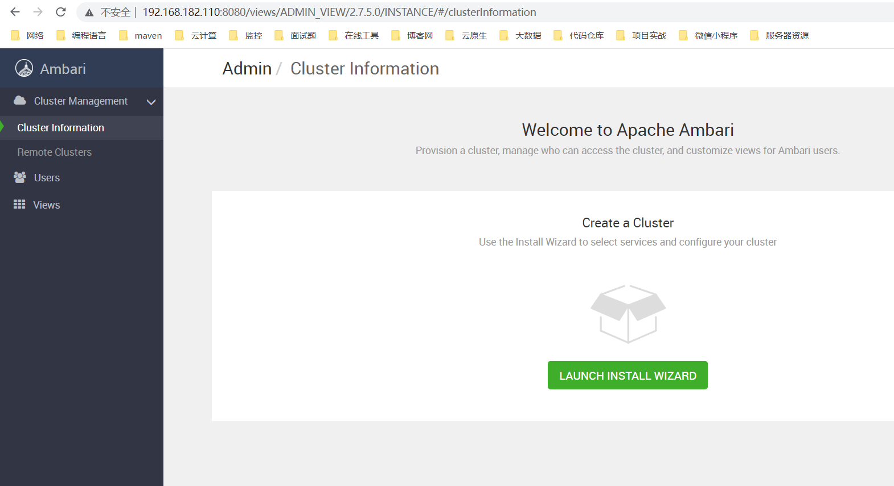

## 五、通过 Apache Ambari 安装 Hadoop 组件
### 1）Cluster Information

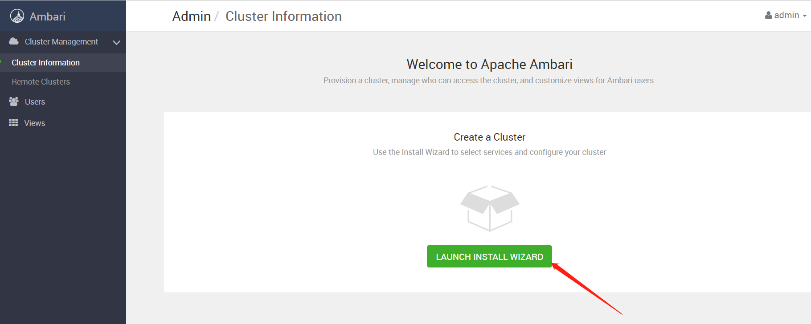

### 2）Get Started

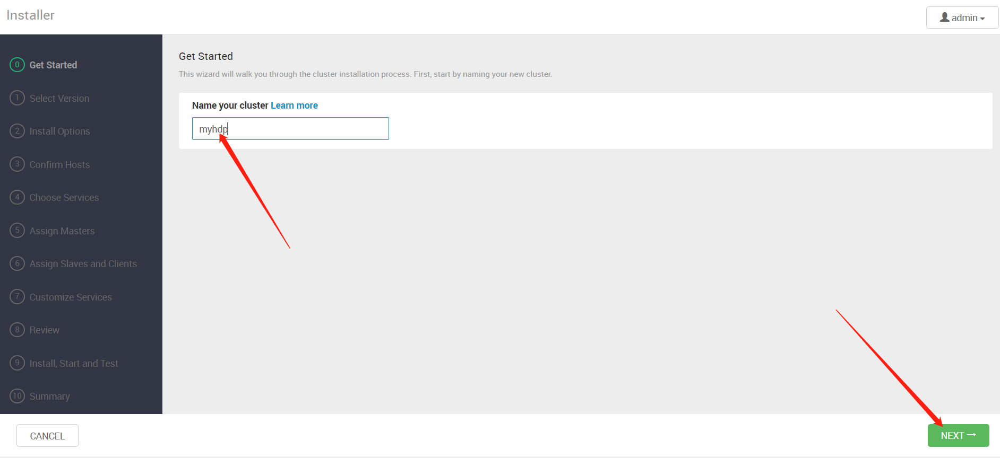
### 3）Select Version

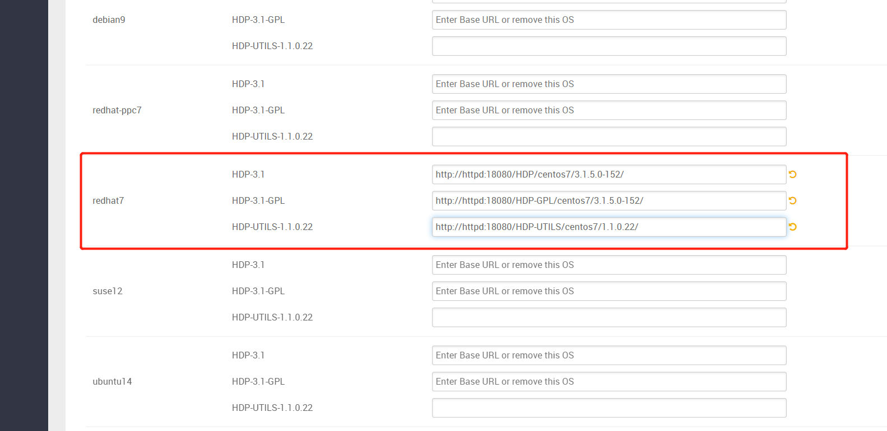

```bash
http://httpd:18080/HDP/centos7/3.1.5.0-152/
http://httpd:18080/HDP-GPL/centos7/3.1.5.0-152/
http://httpd:18080/HDP-UTILS/centos7/1.1.0.22/
```
### 4）Install Options

获取ssh 私钥
```bash
docker exec -it ambari-server cat  ~/.ssh/id_rsa
```

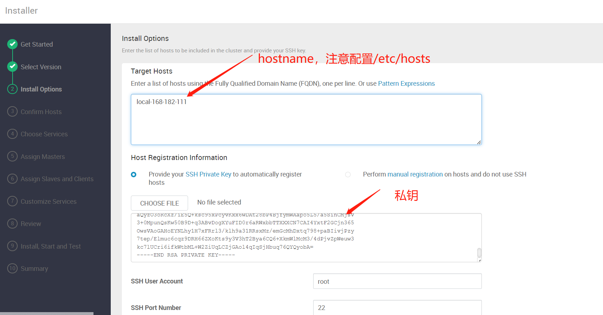
### 5）Confirm Hosts（安装 ambari-agent）
#### 1、配置互信（容器到目标主机）

```bash
# 获取ssh公钥
docker exec -it ambari-server cat  ~/.ssh/id_rsa.pub
```
#### 2、配置yum 源

```bash
scp /etc/yum.repos.d/hdp.repo 192.168.182.111:/etc/yum.repos.d/
scp /etc/yum.repos.d/ambari.repo 192.168.182.112:/etc/yum.repos.d/
```
#### 3、配置hosts

在 `/etc/hosts` 文件中添加如下（注意修改成自己机器的ip）：
```bash
192.168.182.110 httpd
```
#### 3、开始安装 ambari-agent
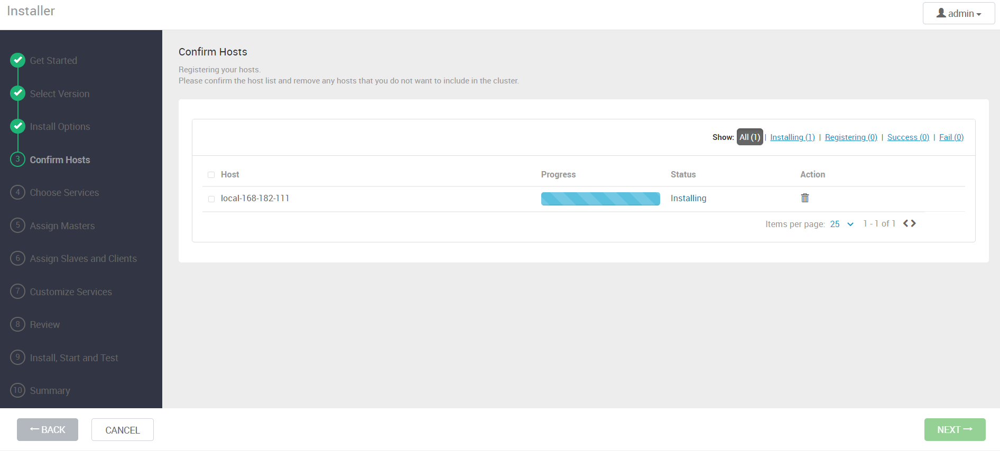
查看日志

```bash
tail -200f /var/log/ambari-agent/ambari-agent.log
```
查看配置

```bash
vi /etc/ambari-agent/conf/ambari-agent.ini
```
安装完成
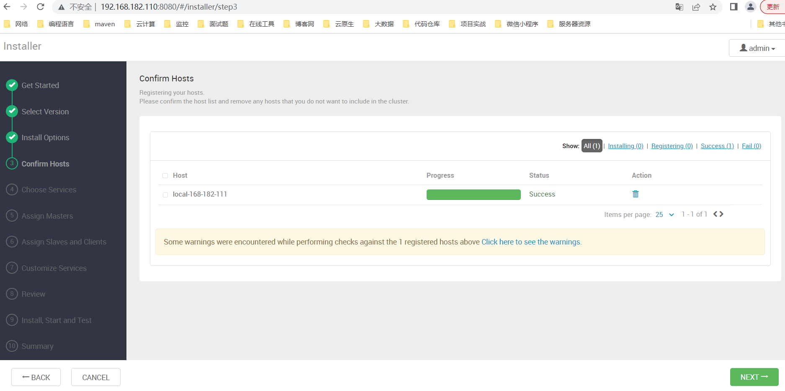
#### 4、安装 JDK（安装大数据组件需要）
官网下载：[https://www.oracle.com/java/technologies/downloads/](https://www.oracle.com/java/technologies/downloads/)

百度云下载
> 链接：https://pan.baidu.com/s/1-rgW-Z-syv24vU15bmMg1w
提取码：`8888`

```bash
mkdir /opt/apache

# 编辑/etc/profile,文末插入以下内容：
# set java
export JAVA_HOME=/opt/apache/jdk1.8.0_212
export PATH=$JAVA_HOME/bin:$PATH
```

### 6）Choose Services（选择所需安装的大数据组件）
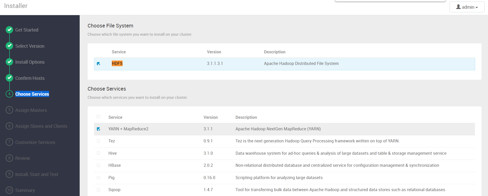
### 7）Assign Masters
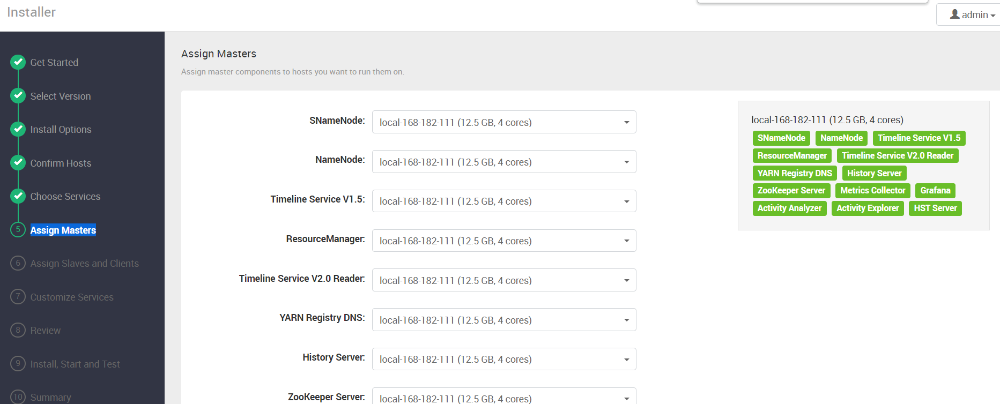
### 8）Assign Slaves and Clients
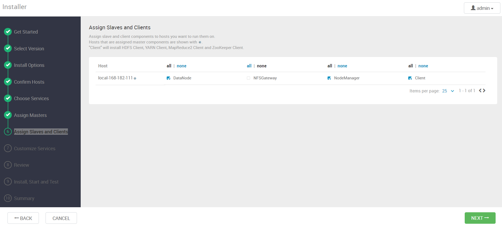
### 9）Customize Services
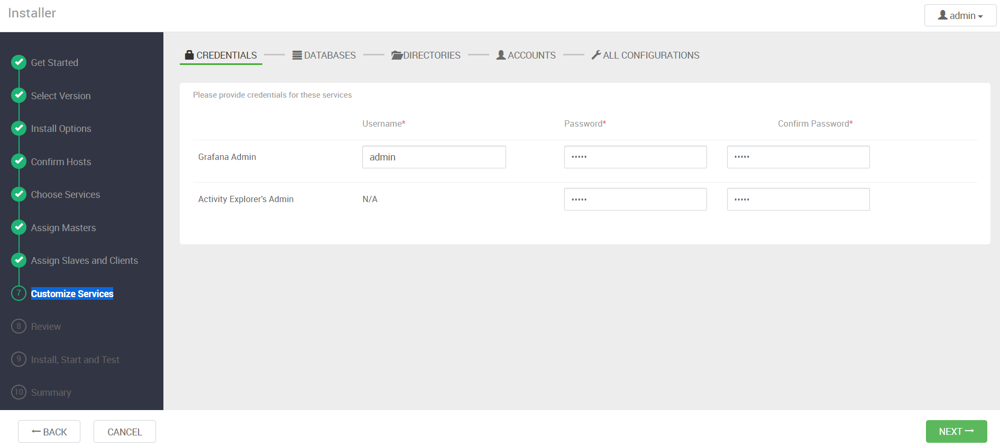
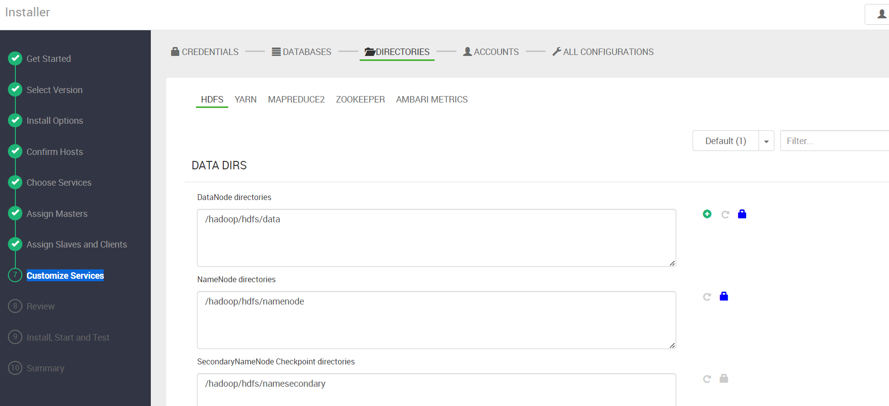
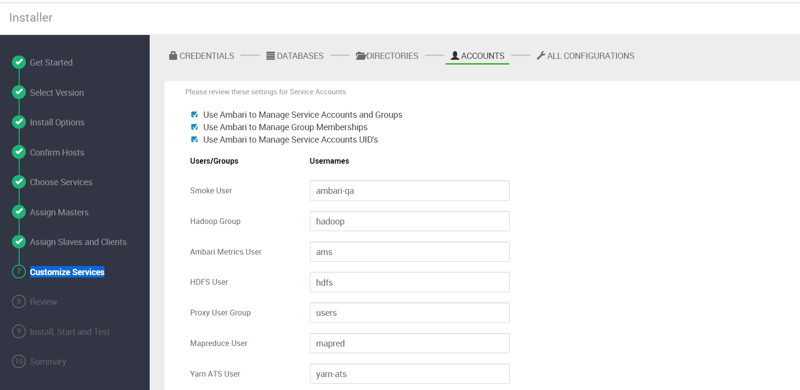
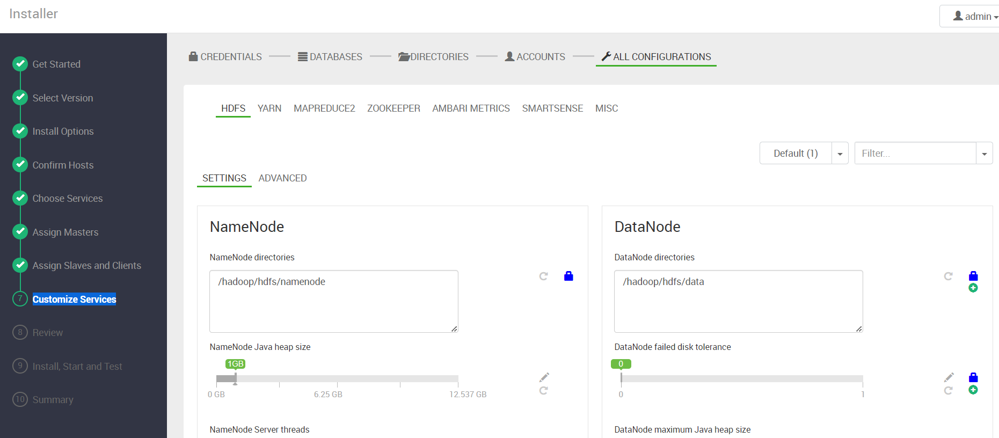
### 10）Review
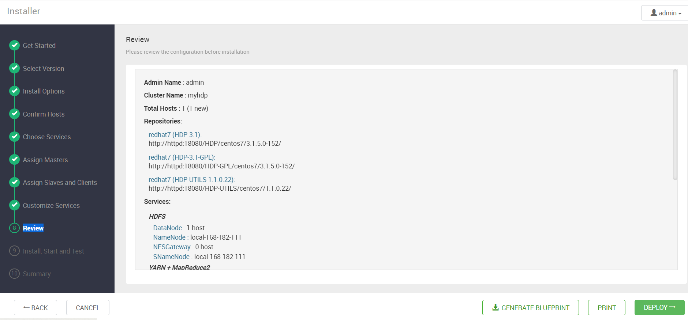
### 11）Install, Start and Test
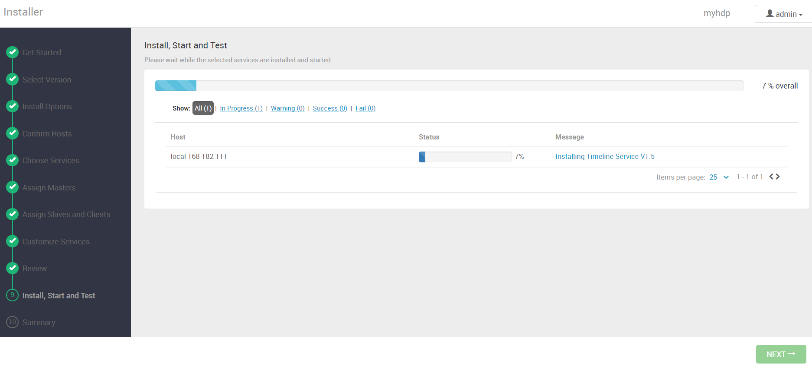
安装完成
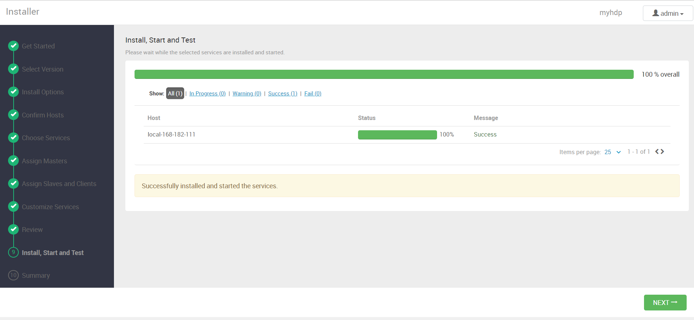
### 12）Summary
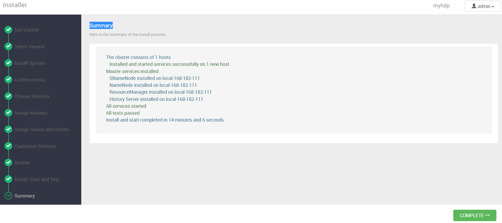
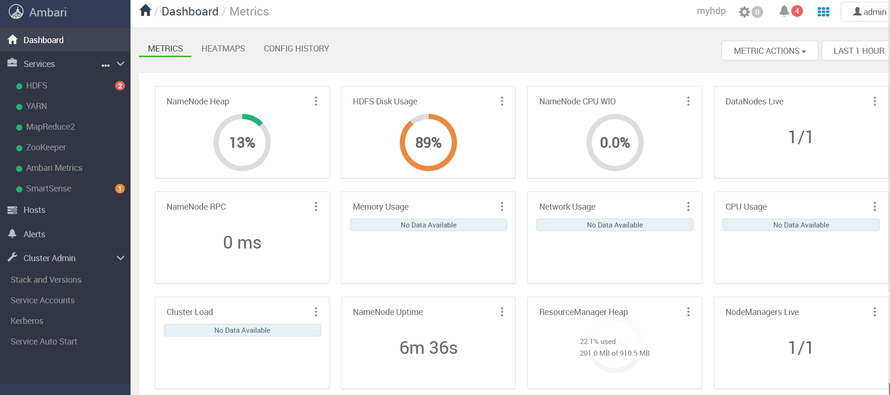

到此通过 docker-compose 快速部署 Apache Ambari 保姆级教程就结束了，安装包获取可关注我公众号：`大数据与云原生技术分享` ，在公众号里回复 `dca` 即可获取下载链接。有任何疑问欢迎给我留言或私信~


